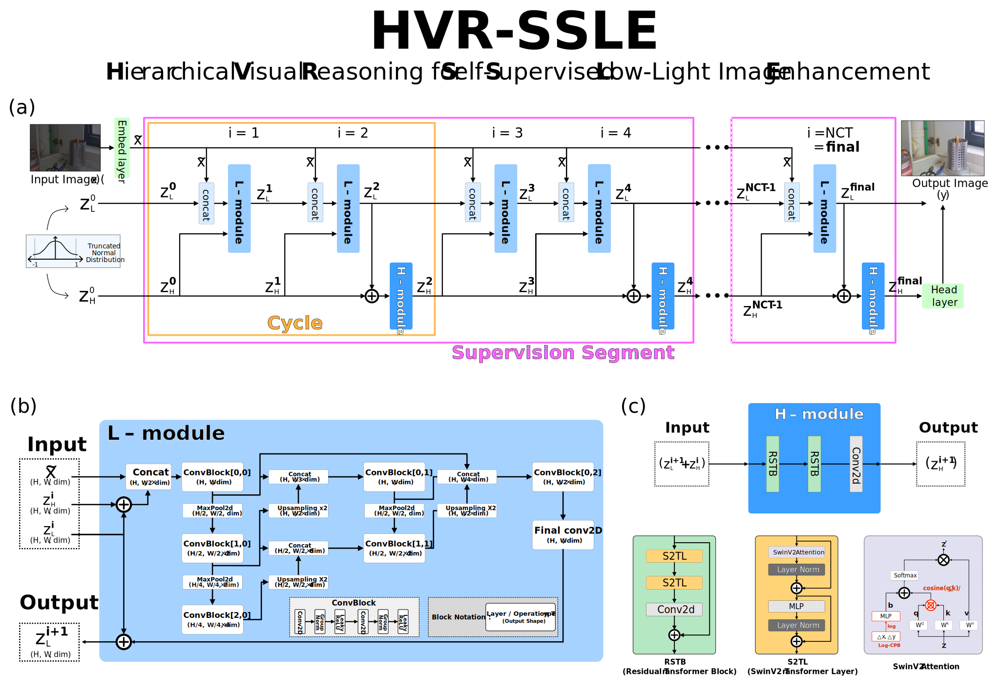

# HVR-SSLE

## Abstract
Low-light image enhancement (LLIE) is a fundamental problem in computational photography, aiming to restore images degraded by coupled noise, color distortion, and detail loss under poor illumination. While recent Transformer- and diffusion-based approaches can improve perceptual quality, they often incur substantial computational costs and may generalize poorly when trained on limited paired benchmarks. In this work, we cast LLIE as an iterative, stepwise refinement process and propose HVR-SSLE (Hierarchical Visual Reasoning for Self-Supervised Low-light image Enhancement), a compact recursive framework that alternates low-level local refinement and high-level global restoration modules for progressive enhancement. Despite having only 0.34M parameters, HVR-SSLE delivers progressive refinement without the heavy computational burden of existing models. We further quantify scene-level train–test overlap in widely used benchmarks such as LOL-v1/v2, highlighting potential evaluation bias. To reduce reliance on LLIE-specific paired data, we train HVR-SSLE in a self-supervised manner on the general-purpose COCO dataset. Diverse low-light inputs are synthesized by applying parametric gamma-based degradation curves to normal-light images. The resulting model is then evaluated in a zero-shot setting on standard LLIE benchmarks. Trained solely on COCO, HVR-SSLE achieves competitive PSNR/SSIM on paired benchmarks such as LOL-v2 (Synthetic) and LSRW, and yields favorable no-reference scores (e.g., NIQE and PIQE) on real-world unpaired datasets including DICM and LIME, indicating strong cross-dataset generalization.

## Architecture


## Requirements
- CUDA 12.x + PyTorch 2.4.0 (GPU recommended).
- Install deps:
  ```bash
  pip install --no-cache-dir -r requirements.txt
  pip install --no-cache-dir opencv-python-headless==4.8.0.74
  ```
- Disable wandb if desired: `export WANDB_DISABLED=true`.

## Docker
- Build:  
  ```bash
  docker build -t hvr-ssle:latest -f dockerfile .
  ```
- Run:  
  ```bash
  docker run --gpus all -v $PWD:/workspace/app -it hvr-ssle:latest
  ```
- Workdir in container: `/workspace/app`.

## Data Layout
- COCO (for training): `dataset/coco/train2017`, `dataset/coco/val2017`, annotations at `dataset/coco/annotations/instances_{train,val}2017.json`.
- Eval sets (examples):
  - LOLv1: `dataset/LOLv1/eval15/{low,high}`
  - LOLv2 Real: `dataset/LOL-v2/Real_captured/Test/{Low,Normal}`
  - LOLv2 Synthetic: `dataset/LOL-v2/Synthetic/Test/{Low,Normal}`
  - LSRW: `dataset/LSRW/Eval/{Huawei,Nikon}/{low,high}`
- Adjust paths in `exp_config/config.py` (`coco_*`, `eval_dataset`).

## Training
- Basic launch (2 GPUs example):
  ```bash
  accelerate launch --num_processes 2 --gpu_ids 0,1 \
    train.py \
    --config_path exp_config/config.py \
    --config_name Config \
    --exp_name short_test
  ```
- Resume:
  ```bash
  accelerate launch ... train.py \
    --config_path exp_config/config.py \
    --config_name Config \
    --exp_name short_test \
    --resume_from_checkpoint checkpoint/HVR-SSLE_short_test_xxxxx/checkpoint_epoch_latest
  ```
- Turn off wandb logging: prefix command with `WANDB_DISABLED=true` (or set in `.env`).

## Inference
- Single image or folder:
  ```bash
  python infer_image.py \
    --config_path checkpoint/config.json \
    --weights_path checkpoint/HVR.safetensors \
    --input_path path/to/img_or_dir \
    --output_dir results/out \
    --device auto
  ```
- Options: `--check_gpu_mem` (dummy run to print GPU memory), overrides for sampling (`--hvr_t`, `--hvr_c`, `--hvr_n_supervision`, `--hvr_n_sup_factor`).
- Example script: edit paths in `infer_image.sh` and run `bash infer_image.sh`.

## Outputs
- Training: `checkpoint/<run>/` holds `config.json`, `checkpoint_epoch_latest`, `best_model`, `wandb_id.txt`.
- Inference: saved to `--output_dir` with original filenames.

## Troubleshooting
- wandb 401: set `WANDB_DISABLED=true` or run `wandb login` with valid token.
- Port conflicts: change `--main_process_port` in `accelerate launch`.
- Data path errors: verify paths in `exp_config/config.py`.
